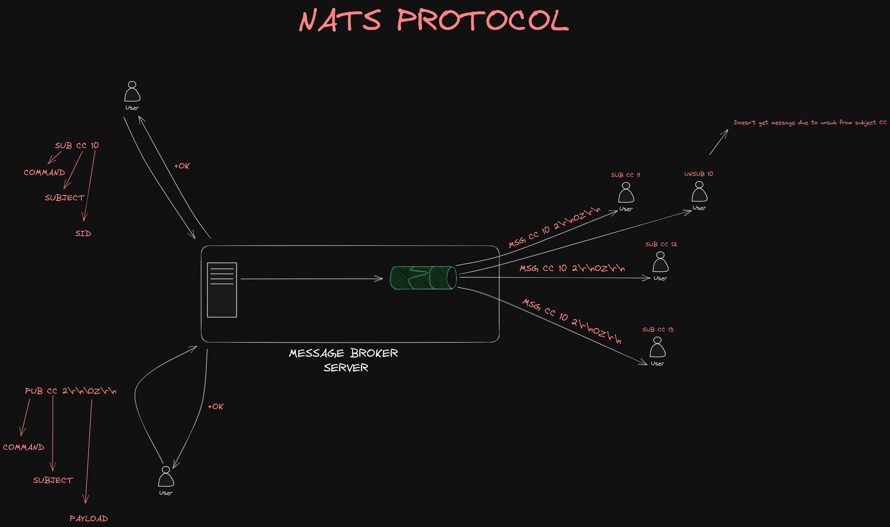

# NATS Message Broker Server Implementation in Rust

This project offers a core implementation of a NATS message broker server.

### Core NATS Commands

---

- **`SUB`**
  - **Purpose**: Subscribe to a subject (also known as a topic or channel) to receive updates when messages are published on that subject.
  - **Example**: `SUB <subject> <queue group> <sid>`

---

- **`PUB`**
  - **Purpose**: Publish a message to a specific subject. Any subscriber listening to that subject will receive the message.
  - **Example**: `PUB <subject> <length>\r\n<payload>`

---

- **`UNSUB`**
  - **Purpose**: Unsubscribe from a subject, identified by the subscription ID that was used during the subscribe (`SUB`) process.
  - **Example**: `UNSUB <sid> <max_msgs>`

---

- **`PING`**
  - **Purpose**: A control message that tests the connection and expects a `PONG` reply from the server.
  - **Example**: `PING`

---

- **`CONNECT`**
  - **Purpose**: Send connection options to NATS. This is usually the first command sent when a new client connects to a NATS server.
  - **Example**: `CONNECT {"verbose":false,"pedantic":false}`

### Little Sketch

I've included a diagram below to offer a clearer perspective on this implementation. This visualization should help elucidate the inner workings and flow of our NATS server replica.

